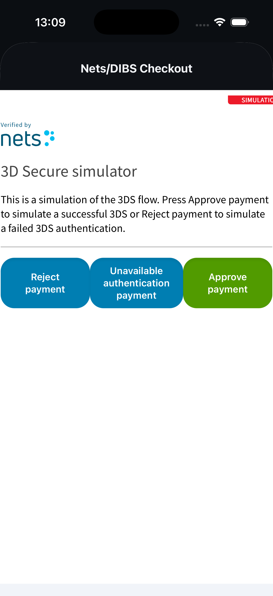
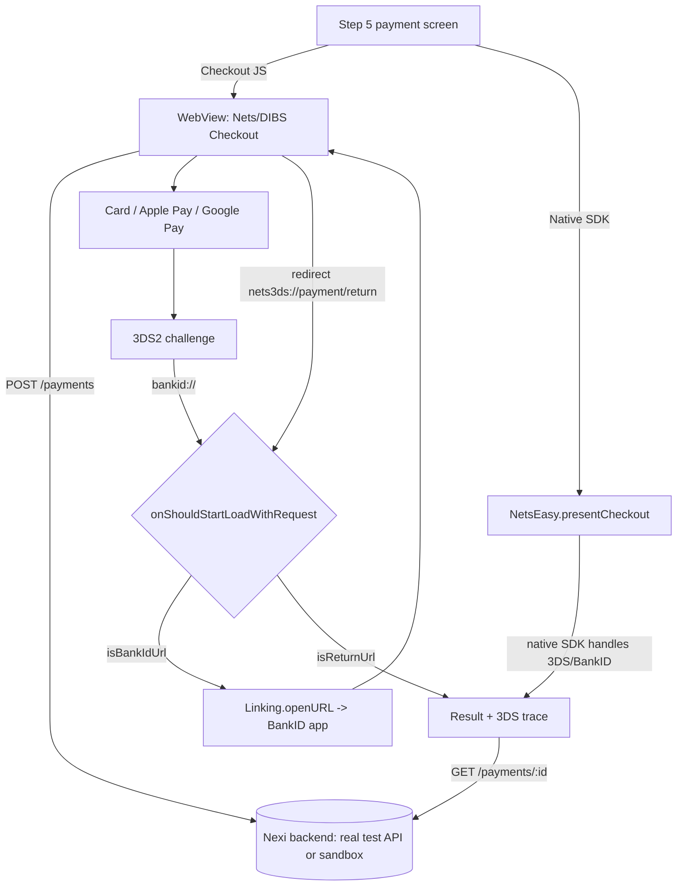

# Nets/DIBS Checkout Demo (Expo / React Native)

A focused demo of **Step 5 - Payment (Nets/DIBS Checkout)** for a money-transfer
app migrating from Flutter to React Native. It implements the **two integration
options** the client is weighing, side by side, and proves the hard part end to
end: a **3DS2 challenge that triggers BankID**, app-switches, and **returns
cleanly into the app**.


## Key question: how does 3DS2 / BankID behave in React Native?

Short answer, both integration paths:

- **Native Nets SDK (Option A, [`Nets-Easy-Android-SDK`](https://github.com/Nets-eCom/Nets-Easy-Android-SDK) /
  `Nets-Easy-iOS-SDK`)** - the SDK owns 3DS2 **and** the BankID app-switch and
  return **internally**. The app calls one method and gets a terminal status back.
  There is nothing for you to intercept. Lowest 3DS/BankID risk because the SDK
  handles the same-device return itself.
- **Checkout JS in a WebView (Option B)** - 3DS2 runs inside the WebView; on a
  Swedish card it fires `bankid://`. The app intercepts that app-switch
  (`Linking.openURL`) and the return URL (`onShouldStartLoadWithRequest`), then
  reconciles the result server-side. Works, but the app-switch **out** of the
  WebView and the return **back** are the fragile part.

> **What this demo proves vs. what still needs a real device:** the demo proves
> the full interception mechanism end to end (app-switch caught, WebView blocked,
> return caught, status confirmed server-side) using Nexi's **test 3-D Secure
> simulator**. It does **not** yet exercise a **real BankID** app-switch on real
> hardware - that is the one remaining unknown and needs a **1-2 day spike on real
> iOS + Android**. Option A removes that unknown because the SDK owns the return.

## The two options (selectable in the app)

| Option | How | This repo |
|---|---|---|
| **A - Native Nets SDK** | RN native module wrapping `Nets-Easy-iOS-SDK` / [`Nets-Easy-Android-SDK`](https://github.com/Nets-eCom/Nets-Easy-Android-SDK). The SDK renders its own UI and drives 3DS/BankID; no WebView. Mirrors the current Flutter `MethodChannel se.malsom/host.base`. | `src/native/NetsEasy.ts` + `modules/nets-easy/{ios,android}` bridge source; `app/native-sdk.tsx` invokes it. |
| **B - Checkout JS SDK** | Hosted Nexi Checkout page in `react-native-webview` (same as the website). The app intercepts the BankID app-switch and the return URL. | `app/checkout.tsx` + `server/routes/checkout.ts` (mounts the **real Checkout JS SDK** when keyed, sandbox otherwise). |

Both options are built so each can be estimated against running code. Option A
uses the same Nets/DIBS SDK you named ([`Nets-Easy-Android-SDK`](https://github.com/Nets-eCom/Nets-Easy-Android-SDK));
Option B is the WebView Checkout JS route. The demo runs B on a bare simulator
and ships the A bridge alongside it.

## What it shows

- **Step 5 payment screen** - amount, method picker (Card / Apple Pay / Google
  Pay), and the **integration-option toggle** (Checkout JS / Native SDK).
- **Checkout JS path** - WebView hosts the Nets/DIBS Checkout. With Nexi test
  keys set, the **real Nexi Checkout** loads in the WebView, live against
  `test.api.dibspayment.eu`; without keys a faithful sandbox stands in.
- **3DS2 -> BankID app-switch** - the page fires `bankid://`; the app intercepts
  it (`Linking.openURL`) and blocks the WebView from following the scheme.
- **Clean return** - the checkout redirects to `nets3ds://payment/return`; the
  app intercepts it, closes the WebView, and reconciles against the backend.
- **Native SDK path** - invokes the `NetsEasy.presentCheckout(paymentId)` bridge;
  in Expo Go (module unlinked) it explains the contract and simulates the result.
- **Observable trace** - the result screen prints every interception step.

## Screenshots

A **real payment completed end to end** in the app WebView against the Nexi test
API: enter a test card, clear the real `3D Secure` step, return into the app, and
have the backend confirm the charge server-side (note the `(TEST)` amount and the
`nets` / `Verified by nets` branding).

| Step 5 - Payment | Real Nexi Checkout (live-test) | Real card + Pay (TEST) |
|---|---|---|
|  |  |  |

| Real 3D Secure | Approved + verified | Native SDK option |
|---|---|---|
|  |  |  |

The 3DS step here is Nexi's **test 3-D Secure simulator** (real BankID caveat
above). Either way the app intercepts the `bankid://` app-switch in code
(`app/checkout.tsx`), and the result screen reads `paid` from a **server-side
check against Nexi**, not from the return URL - the trace shows the raw redirect
carried no status.

## The interception (Checkout JS path)

`react-native-webview` exposes `onShouldStartLoadWithRequest`, a synchronous gate
before every navigation. Three cases, in `app/checkout.tsx`:

```ts
function onShouldStart(req) {
  if (isBankIdUrl(req.url)) { Linking.openURL(req.url); return false; } // app-switch
  if (isReturnUrl(req.url)) { router.replace("/result", ...); return false; } // return
  return true; // checkout page + 3DS ACS pages load normally
}
```

`isBankIdUrl` matches both `bankid://` and the `app.bankid.com` universal link.

## Architecture



## Run

```sh
npm install
cp .env.example .env       # optional: add Nexi test keys for the REAL Checkout JS SDK
npm run server             # backend on :3000 (terminal 1)
npm start                  # Expo (terminal 2), open in Expo Go / simulator
```

Without keys the backend runs in **sandbox** mode and the flow is fully demoable.
With `NEXI_SECRET_KEY` + `NEXI_CHECKOUT_KEY` the backend creates a real payment
on `test.api.dibspayment.eu` and the WebView loads the real Nexi Checkout (the
screenshots above). Get test keys from the Nexi/Nets test portal (Company
settings -> API keys); the secret key stays server-side, the checkout key is
public.

### WebView finding: HostedPaymentPage vs EmbeddedCheckout

This is the answer to "how does Checkout JS behave inside a React Native
WebView", and it shaped the implementation:

- **EmbeddedCheckout** (the `checkout.js` SDK mounted in our own
  `http://localhost` page) renders fine in mobile Safari but **stalls on the SDK
  skeleton inside `WKWebView`**. The payment iframe is third-party there, so iOS
  ITP blocks the cookie it needs. `sharedCookiesEnabled` did not unblock it.
- **HostedPaymentPage** returns a `hostedPaymentPageUrl` on Nexi's **own domain**
  (`test.checkout.dibspayment.eu`). Loading that URL directly makes the checkout
  **first-party**, so it renders reliably in the WebView. The app intercepts the
  same `bankid://` app-switch and the `nets3ds://` return URL.

So the live path uses HostedPaymentPage (`server/routes/payments.ts`); the
EmbeddedCheckout page is kept in `server/routes/checkout.ts` for reference. For
Option B, **prefer the hosted page in the WebView, or an in-app browser tab
(`SFSafariViewController` / `expo-web-browser`)**, over an embedded iframe.

Completing a live-test payment:

- The create call prefills the buyer (`merchantHandlesConsumerData` + a
  `consumer`), so the hosted page skips delivery details and opens on card entry.
- Use a Nexi test card, e.g. Visa `4925 0000 0000 0004`, any future expiry, any
  CVC. The test **3-D Secure simulator** then offers Approve / Reject.
- On Approve, Nexi redirects to `nets3ds://payment/return` (no status param). The
  app intercepts it and calls `GET /payments/:id`, which **proxies the real Nexi
  payment** and maps `reservedAmount`/`chargedAmount` to `paid`. The redirect is
  never trusted on its own.

### Native SDK path (Option A) - dev build

`modules/nets-easy` is a real **Expo Modules API** local module (Swift + Kotlin),
autolinked by Expo. It is not available in Expo Go (which is why the app detects
its absence and simulates the path there). To run it for real, build a dev client:

```sh
npx expo run:ios        # or: npx expo run:android
```

The iOS module is verified to autolink and compile (`pod install` installs the
`NetsEasy` pod; the Swift target builds clean). To go live, add the Nets Easy SDK
dependency in `modules/nets-easy/ios/NetsEasy.podspec` /
`modules/nets-easy/android/build.gradle` and replace the stand-in checkout view
with the real SDK call - the JS contract (`presentCheckout`) stays the same.
