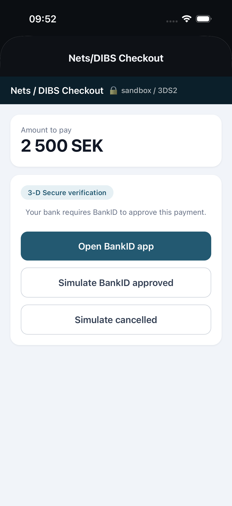
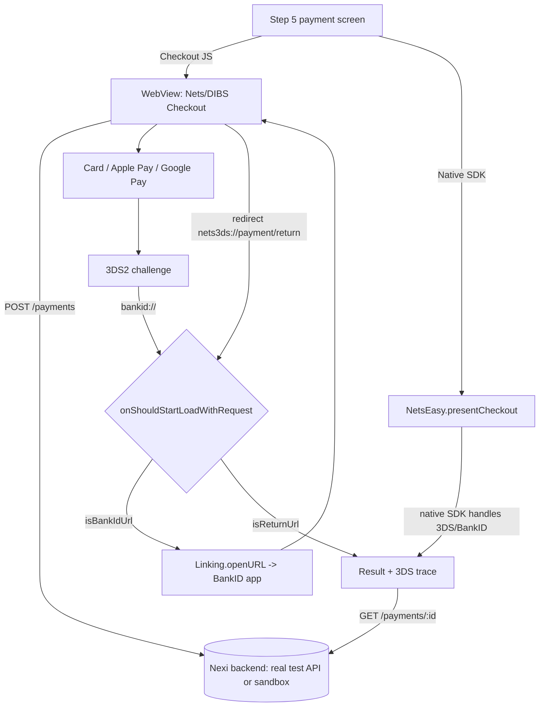

# Nets/DIBS Checkout Demo (Expo / React Native)

A focused demo of **Step 5 - Payment (Nets/DIBS Checkout)** for a money-transfer
app migrating from Flutter to React Native. It implements the **two integration
options** the client is weighing, side by side, and proves the hard part end to
end: a **3DS2 challenge that triggers BankID**, app-switches, and **returns
cleanly into the app**.


## The two options (selectable in the app)

| Option | How | This repo |
|---|---|---|
| **A - Native Nets SDK** | RN native module wrapping `Nets-Easy-iOS-SDK` / `Nets-Easy-Android-SDK`. The SDK renders its own UI and drives 3DS/BankID; no WebView. Mirrors the current Flutter `MethodChannel se.malsom/host.base`. | `src/native/NetsEasy.ts` + `modules/nets-easy/{ios,android}` bridge source; `app/native-sdk.tsx` invokes it. |
| **B - Checkout JS SDK** | Hosted Nexi Checkout page in `react-native-webview` (same as the website). The app intercepts the BankID app-switch and the return URL. | `app/checkout.tsx` + `server/routes/checkout.ts` (mounts the **real Checkout JS SDK** when keyed, sandbox otherwise). |

The client leans toward Option B ("we wonder if we even need the SDK ... switch
to Checkout JS"). This demo shows B working on a bare simulator and ships the A
bridge so both can be estimated against running code.

## What it shows

- **Step 5 payment screen** - amount, method picker (Card / Apple Pay / Google
  Pay), and the **integration-option toggle** (Checkout JS / Native SDK).
- **Checkout JS path** - WebView hosts the Nets/DIBS Checkout; the **real Nexi
  Checkout JS SDK** loads when `NEXI_CHECKOUT_KEY` is set, a faithful sandbox
  otherwise.
- **3DS2 -> BankID app-switch** - the page fires `bankid://`; the app intercepts
  it (`Linking.openURL`) and blocks the WebView from following the scheme.
- **Clean return** - the checkout redirects to `nets3ds://payment/return`; the
  app intercepts it, closes the WebView, and reconciles against the backend.
- **Native SDK path** - invokes the `NetsEasy.presentCheckout(paymentId)` bridge;
  in Expo Go (module unlinked) it explains the contract and simulates the result.
- **Observable trace** - the result screen prints every interception step.

## Screens

| Step 5 - Payment | Nets/DIBS Checkout | 3DS2 challenge |
|---|---|---|
|  |  |  |

| BankID intercept | Result + trace | Native SDK option |
|---|---|---|
|  |  |  |

## The interception (Checkout JS path)

`react-native-webview` exposes `onShouldStartLoadWithRequest`, a synchronous gate
before every navigation. Three cases, in `app/checkout.tsx`:

```ts
function onShouldStart(req) {
  if (isBankIdUrl(req.url)) { Linking.openURL(req.url); return false; } // app-switch
  if (isReturnUrl(req.url)) { router.replace("/result", ...); return false; } // return
  return true; // checkout page + 3DS ACS pages load normally
}
```

`isBankIdUrl` matches both `bankid://` and the `app.bankid.com` universal link.

## Architecture



## Run

```sh
npm install
cp .env.example .env       # optional: add Nexi test keys for the REAL Checkout JS SDK
npm run server             # backend on :3000 (terminal 1)
npm start                  # Expo (terminal 2), open in Expo Go / simulator
```

Without keys the backend runs in **sandbox** mode and the flow is fully demoable.
With `NEXI_SECRET_KEY` + `NEXI_CHECKOUT_KEY` the backend proxies the real Nexi
test API and the WebView mounts the real Checkout JS SDK.

The Native SDK path needs a dev client that bundles `modules/nets-easy`; in Expo
Go it is simulated.

## Production checklist

- Keep the Nexi secret key server-side only; the app uses the public checkout key.
- Verify the final payment server-side via the Nexi webhook / payment status -
  never trust the client redirect alone (the result screen re-checks the backend).
- Register the `nets3ds` return scheme with Nexi and add `bankid` to
  `LSApplicationQueriesSchemes` (iOS) and a browsable intent filter (Android).
- Test the same-device BankID return on real iOS and Android hardware.
- If WebView return proves unreliable, ship Option A behind the same screen
  contract - the bridge is already stubbed in `modules/nets-easy`.
